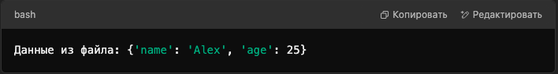

# Tasks_py
Репозиторий с практическими заданиями по Python.

## Структура проекта
- `tasks/` – папка с решениями задач.

## Запуск
1. Клонируйте репозиторий:

   git clone https://github.com/m1rojke/Tasks_py.git

2. Запустите нужный файл:

   python3 tasks/json_example.py

3. Пример вывода:

   